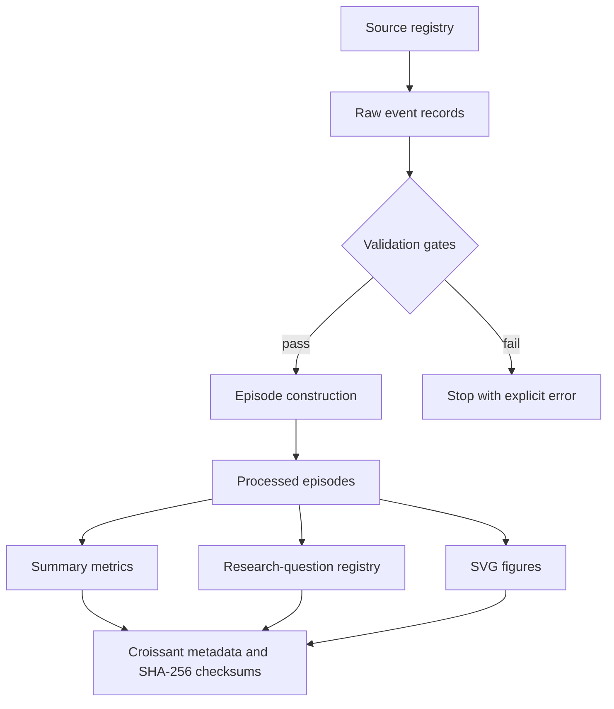

# Data Provenance and Processing Chain

This document records the chain of custody from registered source to displayed result. It intentionally separates **where a record came from**, **how records were joined**, and **what a result can support**.

## Provenance diagram



## Source register

The authoritative source register is `data/source_registry.csv`.

| Source ID | Status | Role | Important boundary |
|---|---|---|---|
| `SRC-SYNTH-001` | Synthetic | Pipeline input | Fictional teaching fixture; not queried from UMA or a chain |
| `SRC-DOC-UMA` | Documentation only | Defines the motivating mechanism | Conceptual reference; not observational evidence |

Each real-data source added by students must have a unique ID, provider, title, canonical URL or archive pointer, retrieval timestamp, terms/license note, coverage statement, role, and status.

## Chain-of-custody table

| Stage | Input | Operation | Output | Validation |
|---|---|---|---|---|
| 1. Register | Source descriptions | Assign stable `source_id` and document retrieval/coverage | `data/source_registry.csv` | Unique IDs; HTTPS canonical URL; UTC retrieval time |
| 2. Record | Source evidence | Normalize one source event per row without joining outcomes | `data/raw/uma_demo_event_log.csv` | Required fields; unique `event_id`; valid event and evidence states |
| 3. Link | Raw events | Group by `episode_id`; order by event time | In-memory event histories | One assertion; one settlement; at most one dispute |
| 4. Validate mechanism | Event histories | Enforce challenge deadline and valid outcome transition | Valid complete histories | Assertion < dispute ≤ deadline < or ≤ settlement as appropriate |
| 5. Construct | Valid histories | Calculate episode times, ratio, duration, and worst evidence state | `data/processed/uma_economic_episodes.csv` | Unique episode rows; nonnegative magnitudes; preserved source refs |
| 6. Analyze | Processed episodes | Apply formulas documented in the variable dictionary | `outputs/summary.csv` | Contract tests for expected fixture results |
| 7. Map research | Schema and data gaps | Declare questions, outcomes, exposures, missing fields, and design | `outputs/research_questions.csv` | Every question states what additional evidence is needed |
| 8. Share | All governed outputs | Generate metadata, checksums, and SVGs | `data/croissant.json`, `data/checksums.sha256`, `figures/` | Deterministic regeneration and CI diff check |

## Episode construction rule

Let episode $i$ contain one assertion $A_i$, zero or one valid dispute $D_i$, and one settlement $S_i$. The teaching pipeline requires:

$$
t(A_i) < t(S_i),
$$

and, when a dispute exists,

$$
t(A_i) < t(D_i) \leq t(A_i)+L_i
\quad\text{and}\quad
t(D_i)<t(S_i),
$$

where $L_i$ is the declared challenge window. For an undisputed episode, settlement must occur no earlier than $t(A_i)+L_i$. The code directly checks these economically essential state and time conditions.

Evidence status is conservatively aggregated: if any constituent record is `unavailable`, the episode is `unavailable`; otherwise, if any is `partial`, the episode is `partial`; only all-complete histories become `complete`.

## Derived fields

For proposer bond $b_i$, explicit reward $r_i$, assertion time $t_i^A$, and resolution time $t_i^S$:

$$
\texttt{reward\_to\_bond\_ratio}_i=\frac{r_i}{b_i},
\qquad
\texttt{resolution\_hours}_i=\frac{t_i^S-t_i^A}{3600}.
$$

The exact definitions, units, intuition, and limitations for every field are documented in `docs/ECONOMIC_VARIABLE_DICTIONARY.md`.

## Integrity and reproducibility

`data/checksums.sha256` records the SHA-256 hash of each source, processed, and result CSV. `data/croissant.json` repeats resource checksums and exposes the processed schema in machine-readable form.

Run:

```bash
python src/reproduce.py
python -m unittest discover -s tests -v
```

GitHub Actions reruns both commands and fails when regenerated derived artifacts differ from committed versions.

## Rules for replacing the fixture with real records

1. Pre-register one time or block window and the relevant contracts/event signatures.
2. Preserve raw records unchanged after retrieval; place transformations only in code.
3. Record token units separately from USD conversion, including price source and valuation timestamp.
4. Keep `not observed`, `not applicable`, and `verified not to have happened` as distinct states.
5. Document exclusions, RPC/indexer failures, reorg handling, duplicates, and unresolved cases.
6. Separate protocol outcome from independently established truth.
7. Archive or hash off-chain evidence needed to reconstruct what was knowable at the decision time.
8. Version any corrected source data and regenerate all downstream artifacts.
