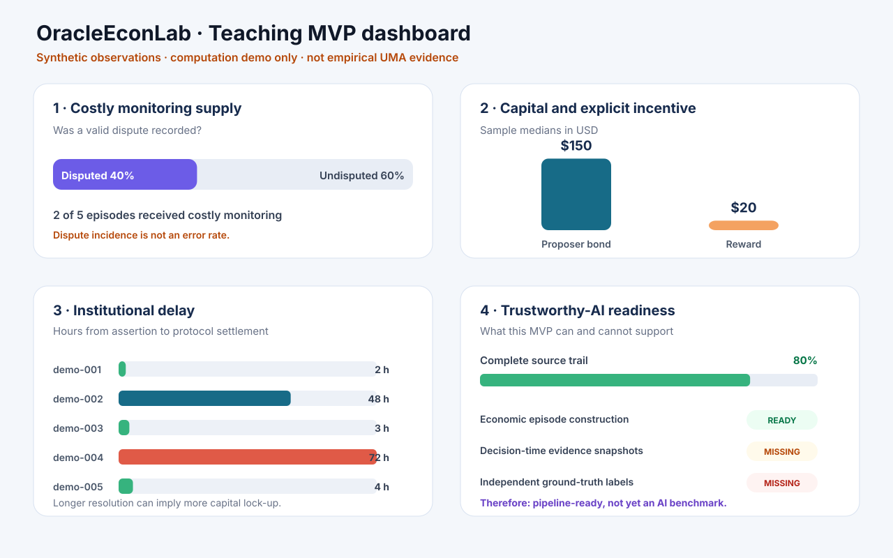
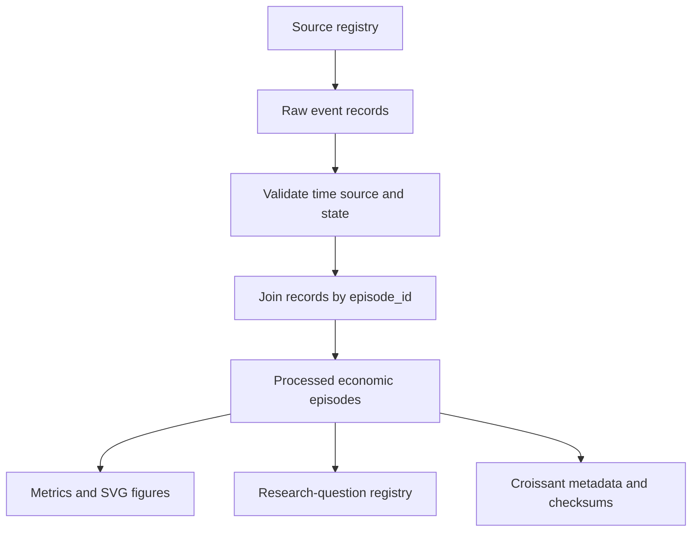
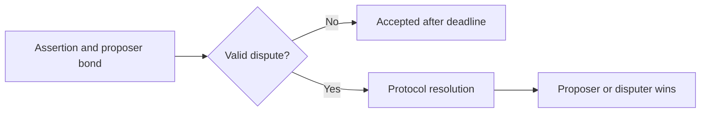
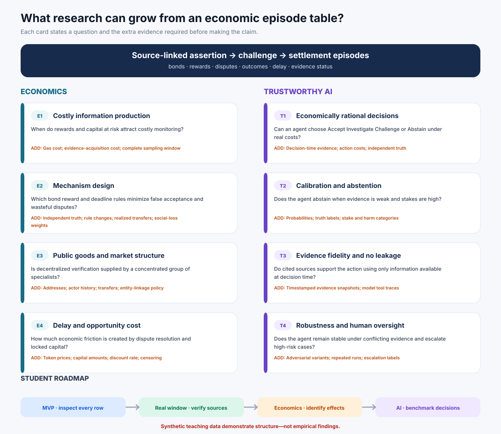

# OracleEconLab

**A teacher-scale, reproducible MVP for Economics × Web3 × Trustworthy AI**

[](https://github.com/sunshineluyao/OracleEconLab/actions/workflows/reproduce.yml)

OracleEconLab shows students how to turn source-linked protocol records into economically meaningful episodes, governed data, research variables, and visual research questions.

> **Evidence boundary:** the bundled five episodes are fictional teaching fixtures. They demonstrate the pipeline and formulas only. They are **not real UMA observations**, not an AI benchmark, and not empirical findings.



## The two ideas students should learn

1. **Construct an economic observation.** Multiple assertion, dispute, and settlement records must be joined into one complete episode before calculating incentives, monitoring, outcomes, or delay.
2. **Make every claim reproducible and auditable.** A result should point back to its source, follow an explicit formula, carry a limitation, and be regenerated by one command.

## One-command reproduction

Python 3.10+ is sufficient; there are no third-party dependencies.

```bash
python src/reproduce.py
```

Or run the full check:

```bash
make check
```

The pipeline validates the source registry and 12 raw event records, constructs 5 processed episodes, calculates 10 metrics, writes 8 research-question specifications, generates Croissant metadata and SHA-256 checksums, and renders two SVG figures. Contract tests run with:

```bash
python -m unittest discover -s tests -v
```

## From source record to research artifact



The economic mechanism represented by one episode is:



`accepted` means that an undisputed assertion became final under the protocol process. It does **not** establish independent truth. Likewise, dispute incidence is not an error rate.

## What is generated

| Layer | Artifact | Purpose |
|---|---|---|
| Source registry | [`data/source_registry.csv`](data/source_registry.csv) | Declares every input source, retrieval time, role, and status |
| Raw records | [`data/raw/uma_demo_event_log.csv`](data/raw/uma_demo_event_log.csv) | Twelve source-like events: assertion, dispute, and settlement |
| Processing code | [`src/reproduce.py`](src/reproduce.py) | Validates, joins, calculates, documents, and visualizes |
| Processed data | [`data/processed/uma_economic_episodes.csv`](data/processed/uma_economic_episodes.csv) | One row per complete economic episode |
| Results | [`outputs/summary.csv`](outputs/summary.csv) | Ten formula-defined descriptive metrics |
| Research design | [`outputs/research_questions.csv`](outputs/research_questions.csv) | Candidate questions, variables, missing data, and minimum designs |
| Visuals | [`figures/`](figures) | A teaching dashboard and an Economics/Trustworthy-AI research map |
| Integrity | [`data/checksums.sha256`](data/checksums.sha256) | File-level integrity checks |

## Data governance and standard sharing

| Governance question | Repository answer |
|---|---|
| What is this dataset and what is it for? | [`DATASET_CARD.md`](DATASET_CARD.md) |
| Where did each record come from and how was it transformed? | [`DATA_PROVENANCE.md`](DATA_PROVENANCE.md) and the source registry |
| What does every variable mean mathematically and intuitively? | [`docs/ECONOMIC_VARIABLE_DICTIONARY.md`](docs/ECONOMIC_VARIABLE_DICTIONARY.md) |
| Can a machine read the dataset structure? | [`data/croissant.json`](data/croissant.json) |
| How can files be integrity-checked? | [`data/checksums.sha256`](data/checksums.sha256) |
| How should the work be cited and reused? | [`CITATION.cff`](CITATION.cff), [`LICENSE`](LICENSE), and [`LICENSE-DATA`](LICENSE-DATA) |
| What changed between versions? | [`CHANGELOG.md`](CHANGELOG.md) |

The package follows the spirit of FAIR data stewardship, Datasheets for Datasets, and MLCommons Croissant while remaining small enough to inspect in one class session.

## What research could grow from it?



The machine-readable [research-question registry](outputs/research_questions.csv) separates three things for every proposed study:

- the research question;
- the variables already represented by the episode schema; and
- the additional evidence required before making the claim.

Four economics directions are demonstrated: costly information production, mechanism design, verification as a public good and market structure, and delay/opportunity cost. Four Trustworthy-AI directions are demonstrated: economically rational action, calibration and abstention, evidence fidelity/no leakage, and robustness with human oversight.

The present data can only demonstrate the structure of these studies. A valid Trustworthy-AI benchmark additionally needs timestamped decision-time evidence, independent ground-truth labels, action costs, model probabilities/traces, and repeated or adversarial runs. See the full [research roadmap](docs/RESEARCH_ROADMAP.md).

## The student's next two tasks / 给学生的两步任务

1. **Replace the fixture with real data.** Select one fixed UMA time or block window; preserve transaction/event references, retrieval timestamps, token amounts, price sources, exclusions, and missing states; then reproduce the processed episode table from raw records.
2. **Choose one research question.** Add only the fields listed as required for that question, update the variable dictionary and provenance, and state whether the analysis is descriptive, predictive, causal, structural, or a benchmark.

Do not begin with multiple protocols, a leaderboard, or causal language. First prove that every real episode can be reconstructed and audited end to end.

## Repository map

```text
OracleEconLab/
├── data/
│   ├── raw/uma_demo_event_log.csv
│   ├── processed/uma_economic_episodes.csv
│   ├── source_registry.csv
│   ├── croissant.json
│   └── checksums.sha256
├── docs/
│   ├── ECONOMIC_VARIABLE_DICTIONARY.md
│   └── RESEARCH_ROADMAP.md
├── figures/
│   ├── demo_dashboard.svg
│   └── research_map.svg
├── outputs/
│   ├── summary.csv
│   └── research_questions.csv
├── src/reproduce.py
└── tests/test_pipeline.py
```
