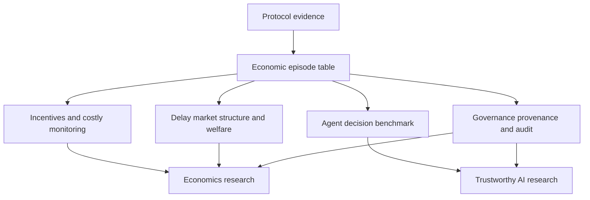
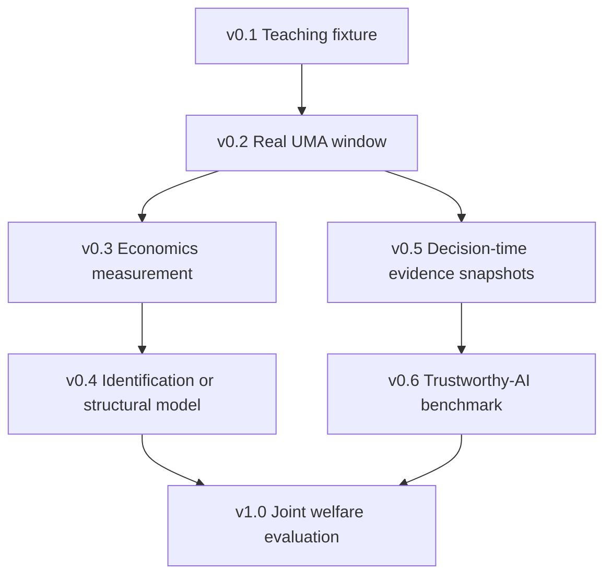

# Research Mind Map and Roadmap

The teaching MVP is the first rung of a research program, not the final dataset. This map keeps the links among protocol evidence, economic theory, open science, and Trustworthy AI explicit.

## Concept map

The central object is one source-linked assertion–challenge–settlement episode. Economics asks how incentives, information costs, strategic interaction, and institutional delay shape behavior. Trustworthy AI asks whether an agent can act reliably, cautiously, transparently, and robustly when evidence is costly and mistakes have financial or social consequences.

## Version roadmap

| Phase | Entry gate | Main deliverable | Exit gate |
|---|---|---|---|
| v0.1 Teaching fixture | Inspect all synthetic records | Working source-to-episode pipeline | One command reproduces governed tables and figures |
| v0.2 Real UMA window | Pre-register contracts and window | Real raw records and source register | Every processed row is traceable and exclusions are documented |
| v0.3 Economics measurement | Complete sampling frame | Incentive, monitoring, delay, and market-structure estimates | Descriptive claims match available variation |
| v0.4 Identification/model | Documented rule variation or model assumptions | Causal, structural, or mechanism-design analysis | Identification assumptions and robustness are explicit |
| v0.5 Decision evidence | Timestamped archived evidence | Leakage-controlled decision snapshots | No post-decision information enters model inputs |
| v0.6 AI benchmark | Independent truth and action-cost model | Accept/Investigate/Challenge/Abstain tasks | Calibration, evidence fidelity, utility, robustness, and repeated runs are scored |
| v1.0 Joint welfare | Both research streams validated | Human-only vs AI-assisted institutional comparison | Benefits, private costs, social loss, and oversight are jointly reported |

## Economics research map

| Question | Existing schema anchor | Data still required | Suitable first design |
|---|---|---|---|
| Does incentive intensity attract monitoring? | `reward_to_bond_ratio`, `was_disputed` | Gas and evidence costs; complete real window | Descriptive model; then exploit rule variation |
| Which rules minimize false acceptance and wasteful disputes? | bond, reward, deadline, outcome, delay | Independent truth; realized transfers; social-loss weights | Mechanism design or structural model |
| Is verification a concentrated public good? | Dispute occurrence | Actor addresses/history and defensible entity linkage | Concentration, panel, and network analysis |
| What is the cost of institutional delay? | bond and `resolution_hours` | Token prices, interest/discount rate, censored episodes | Survival analysis and calibrated opportunity cost |

## Trustworthy-AI research map

For episode $i$, an agent receives only information available by decision time $t_i$ and chooses:

$$
a_i\in\{\text{Accept},\text{Investigate},\text{Challenge},\text{Abstain}\}.
$$

An economically grounded utility can be written as:

$$
U_i(a_i)=R_i-B_i-G_i-C_i^{evidence}-C_i^{delay}-L_i^{social},
$$

where rewards, bond losses, gas, evidence cost, delay, and social loss are kept separate. Accuracy alone is insufficient.

| Trustworthy-AI property | Operational question | Required new evidence |
|---|---|---|
| Reliability | Does the action remain correct and stable across runs? | Independent labels and repeated runs |
| Calibration | Does confidence match empirical correctness? | Probabilities and truth labels |
| Appropriate abstention | Does the agent defer under high uncertainty or stakes? | Stake/harm categories and abstention policy |
| Evidence fidelity | Do cited sources actually support the action? | Timestamped evidence snapshots and tool traces |
| No leakage | Was every input available before the decision? | Creation/retrieval timestamps and archived snapshots |
| Robustness | Does the action survive conflicting or adversarial evidence? | Controlled perturbation variants |
| Human oversight | Are high-risk cases escalated appropriately? | Escalation rules and expert adjudication |

The non-negotiable no-leakage condition is:

$$
X_i(t_i)\cap\{\text{information created after }t_i\}=\varnothing.
$$

## Student assignment: only two next steps

1. Replace the synthetic fixture with a fixed window of real, source-linked UMA records while preserving the same validation and one-command reproduction.
2. Select one row from `outputs/research_questions.csv`, add its required data fields, and state the analysis type and claims that remain out of scope.

The visual overview is generated at `figures/research_map.svg`; its underlying research specifications are stored in the CSV rather than only inside a picture.
